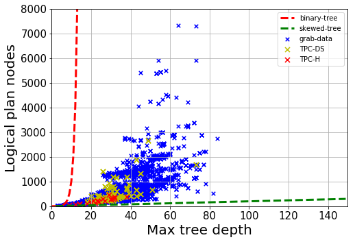

# Grab-Traces & TPC-DS Presto query plans

## TL;DR
Grab-Traces is (to the best of our knowledge) the largest, publicly available industry-based dataset of query plans for research. 

In contrast to open sourced TPC benchmarks, Grab-Traces feature more plan diversity, based on the range of large & small query plans that are realistic to the query patterns seen in large scaled companies. All Grab-Traces query plans are based on real Presto queries executed & profiled over Grab's datalake. 

In order to emphasise the difference between the query plans under the TPC benchmarks and Grab-Traces, we plotted a sample of 245,849 logical plans, obtained over 2 consecutive months in Grab, on their node count and maximum tree depth. We contrasted these plans with TPC-DS & TPC-H templates. The maximum plan (size, depth) observed was (477, 38) for TPC-H, (883, 73) for TPC-DS and (4969, 321) for Grab. 

From the picture, two things become clear:
- Grab's query plans are diverse: We observed a range of very large and small plans issued to our Presto clusters

- Query volumes are large: We observed many distinct queries issued to our Presto clusters. At scale, many of the existing query featurization techniques may be highly inefficient.

## Dataset
We are releasing both our Grab-Traces & TPC-DS dataset, as part of our conference submission to Sigmod 2021.

There are 2 query plan dataset in this repository

Please see [grab-traces](Grab-Traces/)

Please see [tpc-ds](TPC-DS/)

## Licensing 
All data is subjected to the MIT open source licensing scheme. 
For more details, please see [licensing](LICENSE)

## Related Publications
- Johan Kok Zhi Kang, Gaurav, Sien Yi Tan, Feng Cheng, Shixuan Sun, Bingsheng He. Efficient Deep Learning Pipelines for Accurate Cost Estimations Over Large Scale Query Workload. ACM Sigmod 2021. 

## Citations
TODO: Fill in this page once paper is published

## Acknowledgement
- Grab-NUS AI Lab